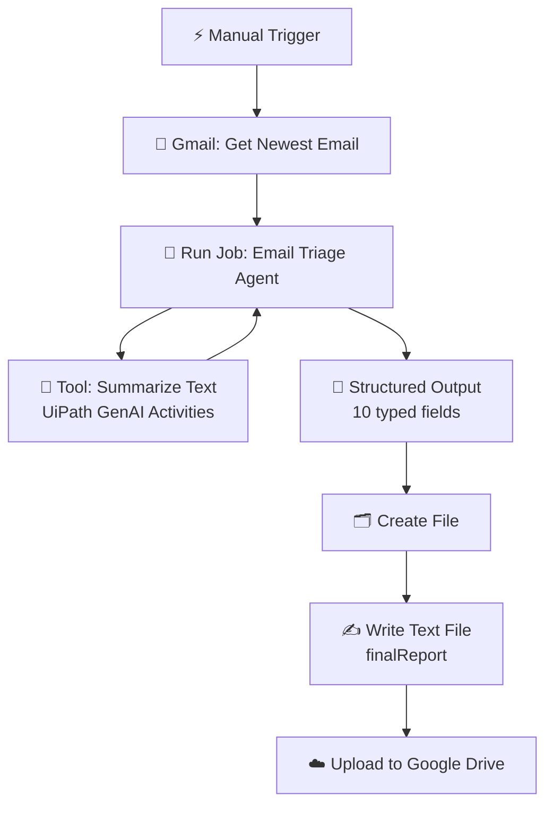

# 📬 Smart Email Triage Agent

> An autonomous AI Agent that reads your inbox, understands each email, and files a structured report to Google Drive — built entirely with **UiPath Studio Web**, **Agent Builder**, and **Integration Service**.

---

## Overview

Traditional RPA follows rules. This project follows *reasoning*.

Instead of hard-coded `if subject contains "invoice"` logic, an autonomous **UiPath AI Agent** reads the full email, decides what it is about, how urgent it is, what actions it demands, and whether it deserves a reply — then hands an RPA workflow a ready-to-file report.

```
Gmail  →  AI Agent (+ Summarize Text tool)  →  Structured Report  →  Google Drive
```

---

## Architecture



---

## What the Agent Returns

The agent does not return prose — it returns a **typed JSON object** the workflow can act on:

| Field | Type | Purpose |
|---|---|---|
| `summary` | String | Concise professional summary |
| `category` | String | Work, Finance, Support, Sales, Marketing, Personal, Spam, Other |
| `priority` | String | Critical, High, Medium, Low |
| `sentiment` | String | Positive, Neutral, Negative |
| `requiresReply` | Boolean | Does the sender expect an answer |
| `keyPoints` | String[] | The points that matter |
| `actionItems` | String[] | `Task - Owner - Due date` |
| `deadlines` | String | Every date mentioned |
| `suggestedReply` | String | A short professional draft |
| `confidence` | Number | 0.0 – 1.0 self-assessment |
| `finalReport` | String | The complete formatted report, ready to write to a file |

### Priority rules the agent applies

| Priority | Trigger |
|---|---|
| **Critical** | Outage, security, legal, payment issue, or a deadline within 24 hours |
| **High** | A direct request to the recipient, or a deadline within 7 days |
| **Medium** | Informational but work related |
| **Low** | Newsletters, marketing, automated notifications |

---

## Sample Output

```text
EMAIL SUMMARY
The production API has been down since 03:40 AM, affecting three enterprise
clients and blocking their month-end processing. Sarah requests a root cause
analysis by tomorrow 10:00 AM before a noon client call and confirmation that
the failover instance is active. Invoice INV-2024-8831 for emergency support
hours (4,500 USD) is due on 25 September.

KEY POINTS
- The production API has been down since 03:40 AM.
- Three enterprise clients have opened tickets.
- A root cause analysis is requested by tomorrow 10:00 AM.
- Confirmation is requested on whether the failover instance is active.
- Invoice INV-2024-8831 is 4,500 USD and due on 25 September.

REQUIRED ACTIONS
- Send the root cause analysis - Eyad - tomorrow 10:00 AM
- Confirm whether the failover instance is active - Eyad - None specified
- Review/pay Invoice INV-2024-8831 (4,500 USD) - None specified - 25 September

IMPORTANT DATES AND DEADLINES
tomorrow 10:00 AM; client call at noon; 25 September

SUGGESTED REPLY
Hi Sarah,

I will send the root cause analysis by tomorrow 10:00 AM and confirm the
current status of the failover instance.

Best,
Eyad
```

> Classified as `priority: Critical` · `category: Support` · `confidence: 0.99`

---

## Tech Stack

| Layer | Technology |
|---|---|
| Agent | UiPath Agent Builder (Autonomous, low-code) |
| Agent tool | Summarize Text — UiPath GenAI Activities |
| Orchestration | UiPath Studio Web — RPA Workflow |
| Email | Gmail via UiPath Integration Service |
| Storage | Google Drive via UiPath Integration Service |
| Runtime | UiPath Automation Cloud / Orchestrator |

---

## Repository Structure

```
.
├── Agent/                     # Agent Builder project
│   ├── agent.json             # Prompts, model settings, I/O schema
│   ├── resources/             # Summarize Text tool definition
│   └── evals/                 # Evaluation sets
├── RPA-Workflow/              # Studio Web process
│   ├── Main.xaml              # The 6-activity workflow
│   └── project.json           # Dependencies
└── README.md
```

---

## Setup

### 1. Connections (Integration Service)

Create these connections on your tenant, all under the **same folder** and the **same Google account**:

- **Gmail** — read the inbox
- **Google Drive** — upload the report
- **UiPath GenAI Activities** — powers the Summarize Text tool

> Grant **all** requested OAuth scopes. A removed scope causes `insufficient permissions` at runtime.

### 2. Google Drive

Create a folder named `Email Triage Reports`.

### 3. Agent

| Setting | Value |
|---|---|
| Type | Autonomous |
| Temperature | `0` — deterministic classification |
| Max tokens | `128000` |
| Max iterations | `25` |
| Tool | Summarize Text, bound to the email body |

### 4. Workflow

| # | Activity | Key configuration |
|---|---|---|
| 1 | Manual Trigger | — |
| 2 | Get Newest Email | Folder `Inbox`, Mark as read `False` |
| 3 | Run Job | The agent · Execution mode **Wait for job completion** |
| 4 | Create File | Name as an **expression**, not literal text |
| 5 | Write Text File | Text = `outputArguments.finalReport` |
| 6 | Upload Files | Destination `Email Triage Reports` |

### 5. Deploy

`Deploy` → pick the Orchestrator folder → attach connections → add a time trigger.

---

## Notes From Building This

Four things cost real debugging time and are worth knowing up front:

1. **Summarize Text is an Integration Service activity, not a process.** Autopilot searches processes and reports it missing. Add it manually from the Tools panel.
2. **Execution mode must be "Wait for job completion".** On fire-and-forget the file is written before the agent finishes, and it lands empty.
3. **Expression fields must be switched to expression mode.** Typed as plain text, `System.IO.Path.GetTempPath()` becomes a literal folder name and the run fails with `DirectoryNotFoundException`.
4. **Temperature must be 0.** Anything higher and the same email is classified `High` on one run and `Medium` on the next — which quietly breaks any evaluation you build later.

---

## Roadmap

- [ ] Batch processing — `Get Email List` + `For Each`
- [ ] Google Sheets triage dashboard
- [ ] Instant alert for `Critical` / `High` emails
- [ ] HTML report with KPI cards instead of plain text
- [ ] Human-in-the-loop escalation via Action Center
- [ ] Evaluation set to measure classification accuracy
- [ ] Time trigger / Email Received trigger for unattended runs

---

## Author

**Mahmoud Elnahal** — RPA & Intelligent Automation
Built during RPA training with **Digital HUB (D-HUB)** and **Orange Digital Center Egypt**.

---

## What's in This Folder

| Path | What it is |
|---|---|
| `Solution.uis` | The full exported solution — import this into UiPath Studio Web to run it yourself |
| `source/Agent/agent.json` | The agent: system prompt, user prompt, model settings, I/O schema |
| `source/Agent/resources/Summarize Text/` | The Summarize Text tool definition |
| `source/Agent/evals/` | Evaluation set and evaluators |
| `source/RPA Workflow/Main.xaml` | The 6-activity workflow |
| `source/resources/solution_folder/` | Connection and process references |

### Import it

1. UiPath Studio Web → **Solutions** → **Import** → upload `Solution.uis`
2. Reconnect the three connections with your own Google account
3. Create a `Email Triage Reports` folder in your Drive
4. Run
