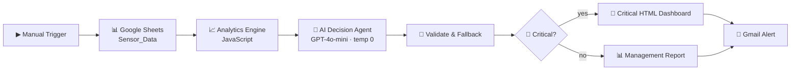

# 🌱 Digital Agriculture AI Agent — n8n

An n8n workflow that turns raw farm sensor readings into an executive decision and an email a manager can act on.



## Nodes

| # | Node | Role |
|---|---|---|
| 1 | Manual Trigger | Starts the demo run |
| 2 | Google Sheets | Reads the `Sensor_Data` sheet |
| 3 | Analytics Engine | Aggregates rows into per-farm metrics, ranks priority farms, computes totals |
| 4 | AI Decision Agent | Reads the aggregate, returns a typed JSON decision |
| 5 | Validate AI Decision | Parses the JSON; on failure, computes an equivalent result from the raw data |
| 6 | Critical Risk? | Routes to alert or routine report |
| 7 | HTML builders | Render the email body |
| 8 | Gmail | Sends it |

## Why aggregate before prompting

The agent never sees raw rows. Node 3 reduces the dataset to totals, averages, per-farm rollups and a ranked priority list. That cuts token cost substantially and gives the model a cleaner signal to reason over.

## Why the validation node matters

An LLM occasionally returns malformed JSON, wraps it in markdown fences, or drops a field. Node 5 strips fences, extracts the outermost JSON object, and — if parsing still fails — builds an equivalent decision from the computed analytics. The workflow completes either way.

## Agent guardrails

```
Use ONLY the supplied data.
Never invent measurements.
Do not claim that irrigation physically happened.
This is decision support, not physical execution.
```

That last line matters: the agent recommends, it does not claim to have acted.

## Setup

1. Import `workflow.json` into n8n
2. Connect credentials: Google Sheets, Gmail, OpenAI
3. Point the Sheets node at your own spreadsheet
4. Change the recipient in both Gmail nodes
5. Run

---

## Sample Data

`sample-data/` contains the dataset the workflow reads — 120 sensor records across 8 farms in Egyptian governorates, generated for the demo.

| File | Rows | Contents |
|---|---|---|
| `Sensor_Data.csv` | 120 | One row per sensor reading |
| `Farm_Summary.csv` | 8 | Pre-aggregated per farm |
| `Dashboard_KPIs.csv` | 8 | Headline numbers |
| `sensor-data-sample.xlsx` | — | All three sheets in one workbook |

### `Sensor_Data` columns

| Column | Meaning |
|---|---|
| `Record_ID`, `Timestamp`, `Sensor_ID` | Identity and time of the reading |
| `Farm`, `Region`, `Crop`, `Crop_Stage` | Where and what is growing |
| `Temperature_C`, `Humidity_pct`, `Soil_Moisture_pct` | Environment |
| `Rain_Probability_pct`, `Soil_pH`, `Water_Tank_pct` | Context for the irrigation decision |
| `Leaf_Health_pct` | Plant condition |
| `AI_Risk`, `AI_Decision` | Per-reading risk level and recommended action |
| `Irrigation_Minutes`, `Estimated_Water_Liters`, `Estimated_Energy_kWh` | Resource cost |
| `Notification_Required` | Whether the reading warrants an alert |

> `workflow.json` ships with credentials, the recipient address and the spreadsheet ID replaced by placeholders. Swap in your own before running.
