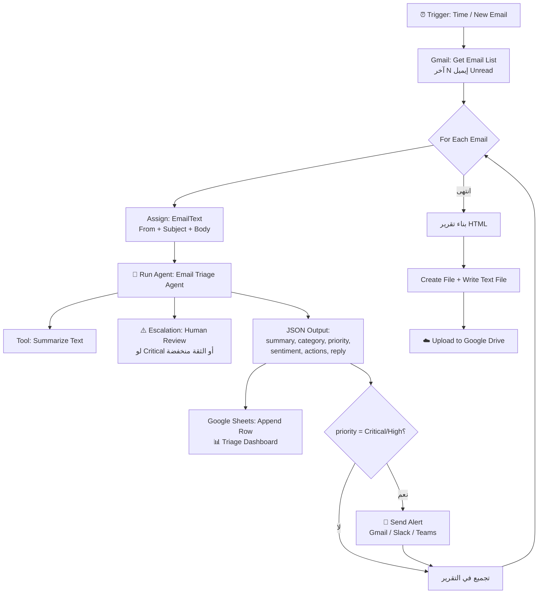

# 🧠 Smart Email Triage & Reporting Agent
### دليل بناء كامل خطوة بخطوة — UiPath Studio Web + AI Agent

> النسخة المطوّرة من مشروع Email Summarization. نفس الفكرة، بس على مستوى أعلى بكتير: بتفرز البريد كله، بتصنّفه، بتديله أولوية، بتسجّله في Dashboard، وبتنبّهك فوراً على المهم.

---

## 0) الفرق بين المشروع الأصلي والنسخة دي

| | المشروع الأصلي | النسخة المطوّرة |
|---|---|---|
| عدد الإيميلات | إيميل واحد (الأحدث) | Batch (آخر 10–20 إيميل غير مقروء) |
| مخرجات الـ Agent | نص عادي (string) | **JSON منظّم (Structured Output)** |
| الذكاء | تلخيص بس | تلخيص + **تصنيف** + **أولوية** + **Sentiment** + **هل يحتاج رد** + **رد مقترح** |
| التسجيل | ملف .txt | **Google Sheets Dashboard** + تقرير HTML |
| التنبيه | مفيش | **Alert فوري** للإيميلات Critical/High |
| العنصر البشري | مفيش | **Escalation → Action Center** (Human-in-the-loop) |
| الجودة | مفيش قياس | **Evaluation Set** لقياس دقة الـ Agent |
| التشغيل | Manual Trigger | **Time Trigger / Email Received Trigger** |
| الأخطاء | مفيش | **Try/Catch + Retry Scope + Logging** |

الـ 4 نقط الملوّنة دي (Structured Output / Escalation / Evaluation / Trigger) هي اللي هتخلّي البوست بتاعك مختلف عن أي حد تاني عامل نفس المشروع.

---

## 1) المعمارية



---

## 2) التحضير — الـ Connections المطلوبة

قبل ما تبدأ، روح على **Integration Service** في cloud.uipath.com واعمل Connect لـ:

| Connection | ليه؟ | إجباري؟ |
|---|---|---|
| **Gmail (Google Workspace)** | قراءة الإيميلات + إرسال التنبيه | ✅ |
| **Google Drive** | رفع التقرير | ✅ |
| **Google Sheets** | الـ Dashboard | ✅ |
| **UiPath GenAI Activities** | أداة Summarize Text | ✅ |
| **Slack / Microsoft Teams** | تنبيه فوري (بديل الإيميل) | ⬜ اختياري |

> 💡 قبل ما تبدأ الشغل: افتح Google Sheets واعمل شيت اسمه **Email Triage Dashboard** وحط فيه الهيدر ده في أول صف:
> `Timestamp | Sender | Subject | Category | Priority | Sentiment | Needs Reply | Summary | Action Items`

---

## 3) الجزء الأول: بناء الـ Agent

### 3.1 نص Autopilot جاهز للّصق

إنت واقف دلوقتي على شاشة **Definition** وفيها خانة "Describe the agent you want to create". الصق النص ده فيها:

```text
Create an autonomous Email Triage Agent.

Input: the full content of a single email (sender, subject and body).

The agent must analyze the email and return a structured JSON result containing:
- summary: a concise professional summary of the email
- category: one of Work, Finance, Support, Sales, Marketing, Personal, Spam, Other
- priority: one of Critical, High, Medium, Low
- sentiment: one of Positive, Neutral, Negative
- requiresReply: true or false
- keyPoints: the most important points in the email
- actionItems: the required actions with owner and due date when mentioned
- deadlines: any dates or deadlines mentioned in the email
- suggestedReply: a short professional draft reply if a reply is needed
- confidence: a number between 0 and 1 describing how confident the analysis is

The agent must use the Summarize Text tool on the email body before producing the summary.
The agent must never invent information that is not present in the email.
The output language must match the language of the email.
```

اضغط Enter وسيب Autopilot يعمل الهيكل، وبعدين **راجع كل حاجة بنفسك** بالخطوات اللي تحت (Autopilot بيجيب 70% والباقي إنت).

---

### 3.2 الـ Input Schema (من Data Manager)

افتح **Data Manager** على الشمال → **Input arguments** → ضيف:

| الاسم | النوع | Required | الوصف |
|---|---|---|---|
| `emailContent` | String | ✅ | The full email content including sender, subject and body. |
| `senderName` | String | ⬜ | The display name of the sender. |
| `emailSubject` | String | ⬜ | The subject line of the email. |

---

### 3.3 الـ Output Schema (أهم خطوة 🔑)

دي اللي بتفرّق المشروع ده عن الأصلي. في **Output arguments** ضيف:

| الاسم | النوع | الوصف اللي تكتبه |
|---|---|---|
| `summary` | String | A concise professional summary of the email. |
| `category` | String | One of: Work, Finance, Support, Sales, Marketing, Personal, Spam, Other. |
| `priority` | String | One of: Critical, High, Medium, Low. |
| `sentiment` | String | One of: Positive, Neutral, Negative. |
| `requiresReply` | Boolean | True if the email expects a response from the recipient. |
| `keyPoints` | Array of String | The most important points, each as a separate item. |
| `actionItems` | Array of String | Required actions, each formatted as "Task — Owner — Due date". |
| `deadlines` | String | All dates and deadlines mentioned, or "None specified". |
| `suggestedReply` | String | A short professional draft reply, or empty if no reply is needed. |
| `confidence` | Number | Confidence of the analysis between 0 and 1. |

> ⚠️ **ملاحظة مهمة:** لو واجهت مشكلة في ربط الـ `Array of String` بمتغير في الـ Workflow، حوّل `keyPoints` و `actionItems` لـ **String** عادي وقول للـ Agent في الـ System Prompt إنه يفصل كل عنصر بسطر جديد. أبسط وأضمن، ونفس النتيجة في التقرير.

---

### 3.4 الـ System Prompt (انسخه كما هو)

```text
You are a Smart Email Triage Agent working inside an RPA automation pipeline.

## Your job
Analyze one email and return a precise, structured triage result that a business user and an automated workflow can both act on.

## Rules
1. Read the complete email content provided in emailContent.
2. Before writing the summary, ALWAYS call the "Summarize Text" tool on the email body and use its output as the basis of your summary.
3. Never invent, assume, or add information that is not present in the email.
4. Ignore greetings, signatures, legal disclaimers, tracking links and repeated quoted threads.
5. Preserve names, amounts, invoice numbers, dates and deadlines EXACTLY as written.
6. Write every text field in the SAME language as the original email.
7. If a field has no relevant information, write "None specified" (or an empty array for list fields).

## Classification rules
- category: Work, Finance, Support, Sales, Marketing, Personal, Spam, Other.
- priority:
  * Critical = production outage, security incident, legal or payment issue, or a deadline within 24 hours.
  * High = explicit request directed at the recipient, or a deadline within 7 days.
  * Medium = informational but relevant to the recipient's work.
  * Low = newsletters, notifications, marketing, automated messages.
- sentiment: Positive, Neutral, or Negative based on the sender's tone.
- requiresReply: true only if the sender explicitly or implicitly expects an answer.
- confidence: between 0 and 1. Use a value below 0.6 when the email is ambiguous, truncated, or written in mixed languages.

## Escalation rule
If priority is "Critical" OR confidence is below 0.6, raise the "Human Review" escalation and include the summary and your reasoning before returning the final result.

## Suggested reply
If requiresReply is true, write a short, polite, professional draft reply (maximum 5 sentences) that directly addresses the sender's request. Do not commit to anything that is not stated in the email. Otherwise leave suggestedReply empty.

## Output
Return ONLY the structured output fields. No explanations, no markdown, no extra commentary.
```

---

### 3.5 الـ User Prompt

```text
Analyze and triage the following email.

Sender: {{input.senderName}}
Subject: {{input.emailSubject}}

Email content:
{{input.emailContent}}

Return the structured triage result using the required output schema.
```

> عشان تدخّل المتغيّر: اكتب `{{` في الخانة وهتلاقي قائمة بالـ inputs تختار منها.

---

### 3.6 الـ Model Settings (Properties على اليمين)

| الإعداد | القيمة | ليه |
|---|---|---|
| Model | أحدث موديل متاح عندك | جودة التصنيف |
| **Temperature** | `0` | تصنيف ثابت ومتكرر — مهم جداً |
| Max tokens | `128000` | إيميلات طويلة |
| Max iterations | `25` | يكفي للـ Tool + Escalation |

---

### 3.7 الـ Tools

في قسم **Tools** → **Add tool** → **Integration Service** → **UiPath GenAI Activities** → **Summarize Text**.

اضبط الـ parameters:

| Parameter | القيمة |
|---|---|
| `prompt` (Text to summarize) | اربطها بـ `{{emailContent}}` |
| `summaryFormat` | `Bulleted list` |
| `maxWordCount` | `120` |
| `detectInputLanguage` | `true` |
| `temperature` | `0.2` |

**Tool description** (مهمة جداً — الـ Agent بيقرر يستخدم الأداة بناءً عليها):
```text
Summarizes long email text into concise bullet points using a UiPath LLM. Call this tool once with the full email body before producing the final summary field.
```

---

### 3.8 الـ Escalation (العنصر البشري 🧑‍⚖️)

ده اللي بيخلّي المشروع "Agentic" بجد مش مجرد استدعاء LLM.

1. في قسم **Escalations** → **Add escalation**.
2. اختار **Action App** (لازم تكون منشورة على الـ tenant بتاعك — لو مش موجودة اعمل واحدة بسيطة من Action Center أو استخدم التمبليت الجاهز).
3. **Prompt**: 
   ```text
   Raise this escalation whenever the email priority is Critical, or whenever your confidence in the analysis is below 0.6, so a human can review the triage before it is logged.
   ```
4. **Assignment**: حط الإيميل بتاعك.
5. **Inputs**: `summary`، `priority`، `reason`.
6. **Outcome behavior**:
   - `Approved` → **Continue** (الـ Agent يكمّل بالنتيجة)
   - `Rejected` → **Continue** بالقيم اللي عدّلها الإنسان
   - `Cancelled` → **End**

> 📌 ده الجزء اللي هيخلّي حد في التعليقات يسألك "إزاي عملت الـ human-in-the-loop؟" — وده اللي عايزينه.

---

### 3.9 الـ Evaluation Set (قياس الجودة 📏)

من **Project Explorer** → **Evaluation Sets** → اعمل set جديد وضيف **5–8 حالات** حقيقية:

| # | الإيميل التجريبي | المتوقع |
|---|---|---|
| 1 | إيميل فاتورة متأخرة بتاريخ استحقاق بكرة | category=Finance, priority=Critical |
| 2 | Newsletter من موقع تقني | category=Marketing, priority=Low, requiresReply=false |
| 3 | مدير بيطلب تقرير الأسبوع الجاي | category=Work, priority=High, requiresReply=true |
| 4 | شكوى عميل بنبرة غاضبة | sentiment=Negative, category=Support |
| 5 | إيميل عربي فيه ميعاد اجتماع | اللغة في المخرجات عربي |
| 6 | إيميل مقطوع / ناقص | confidence < 0.6 |

شغّل الـ Evaluation وصوّر النتيجة (Screenshot) — **دي أقوى صورة تحطها في البوست**، لأن 99% من الناس مش بيعملوا evals.

---

## 4) الجزء الثاني: بناء الـ RPA Workflow

> ⚙️ المشروع الأصلي بتاعك مضبوط على **C# expressions** (`"expressionLanguage": "CSharp"`) — كل الأكواد اللي تحت مكتوبة C#. لو مشروعك VB هقولك البديل في آخر القسم.

### 4.1 الـ Variables

اعمل الـ variables دي في الـ Main Sequence:

| الاسم | النوع | ملاحظات |
|---|---|---|
| `emails` | `List<GmailMessage>` | مخرجات Get Email List |
| `email` | `GmailMessage` | متغير الـ For Each |
| `senderName` | `String` | |
| `summary` | `String` | من الـ Agent |
| `category` | `String` | من الـ Agent |
| `priority` | `String` | من الـ Agent |
| `sentiment` | `String` | من الـ Agent |
| `requiresReply` | `Boolean` | من الـ Agent |
| `keyPoints` | `List<String>` | من الـ Agent |
| `actionItems` | `List<String>` | من الـ Agent |
| `deadlines` | `String` | من الـ Agent |
| `suggestedReply` | `String` | من الـ Agent |
| `confidence` | `Double` | من الـ Agent |
| `reportRows` | `String` | تراكم صفوف HTML |
| `totalCount` | `Int32` | Default = `0` |
| `urgentCount` | `Int32` | Default = `0` |
| `reportFile` | `ILocalResource` | مخرجات Create File |
| `writtenFile` | `ILocalResource` | مخرجات Write Text File |

---

### 4.2 خطوات الـ Workflow بالترتيب

#### 1️⃣ Trigger

ابدأ بـ **Manual Trigger** وإنت بتطوّر (أسهل في الـ Debug)، وبعد ما يشتغل بدّلها بواحدة من دول:

- **Time Trigger** → كل ساعة أو كل يوم الساعة 8 صباحاً *(الأسهل والأنضف للديمو)*
- **Email Received** (Google Workspace trigger) → يشتغل لحظة وصول إيميل جديد *(الأكثر إبهاراً)*

---

#### 2️⃣ Gmail → **Get Email List**

| Property | القيمة |
|---|---|
| Connection | حساب Gmail بتاعك |
| Folder / Label | `INBOX` |
| Unread only | `True` |
| Max results | `10` |
| Mark as read | `False` *(سيبها False وإنت بتجرّب!)* |
| **Output** | `emails` |

---

#### 3️⃣ **Log Message** (Info)

```csharp
"🔎 Found " + emails.Count.ToString() + " unread emails to triage."
```

---

#### 4️⃣ **If** — حماية من الـ Inbox الفاضي

الشرط:
```csharp
emails == null || emails.Count == 0
```
- **Then** → Log Message: `"No unread emails. Nothing to do."` ثم **Terminate Workflow** (أو سيبها تخلص عادي)
- **Else** → كمّل باقي الخطوات جوّاها

---

#### 5️⃣ **For Each** — `email` in `emails`

`TypeArgument` = `UiPath.GSuite.Models.GmailMessage`

كل اللي تحت ده جوّه الـ For Each 👇

---

#### 6️⃣ **Assign** — `senderName`

```csharp
email.From != null && !String.IsNullOrWhiteSpace(email.From.DisplayName) ? email.From.DisplayName : (email.From != null ? email.From.Address : "Unknown Sender")
```

---

#### 7️⃣ **Assign** — `emailText` (متغير String مؤقت)

```csharp
"From: " + senderName + Environment.NewLine +
"Subject: " + email.Subject + Environment.NewLine +
Environment.NewLine +
email.Body
```

> لو `email.Body` طلع HTML خام وعايز تنضّفه:
> ```csharp
> System.Text.RegularExpressions.Regex.Replace(email.Body, "<[^>]+>", " ")
> ```

---

#### 8️⃣ 🤖 **Run Agent** — `Email Triage Agent`

اسحب الـ Agent من الـ Solution (نفس طريقة `Run Agent: Agent` في المشروع الأصلي).

**Input arguments:**

| Argument | القيمة |
|---|---|
| `emailContent` | `emailText` |
| `senderName` | `senderName` |
| `emailSubject` | `email.Subject` |

**Output arguments:** اربط كل واحد بالمتغير اللي بنفس الاسم: `summary`, `category`, `priority`, `sentiment`, `requiresReply`, `keyPoints`, `actionItems`, `deadlines`, `suggestedReply`, `confidence`.

---

#### 9️⃣ **Log Message** (Info) — للتتبّع أثناء الـ Debug

```csharp
"[" + priority + "] " + category + " | " + senderName + " | conf=" + confidence.ToString("0.00")
```

---

#### 🔟 Google Sheets → **Append Row** (الـ Dashboard 📊)

| Property | القيمة |
|---|---|
| Connection | Google Sheets |
| Spreadsheet | `Email Triage Dashboard` |
| Sheet name | `Sheet1` |

**Values** (مصفوفة):
```csharp
new object[] {
    DateTime.Now.ToString("yyyy-MM-dd HH:mm"),
    senderName,
    email.Subject,
    category,
    priority,
    sentiment,
    requiresReply ? "Yes" : "No",
    summary,
    String.Join(" | ", actionItems)
}
```

> 🔁 لو مالقيتش **Append Row** في النسخة عندك، استخدم **Write Range** وحدّد `Range` = `"A" + (rowIndex).ToString()` مع متغير عدّاد، أو استخدم **Write Row**.

---

#### 1️⃣1️⃣ **Assign** — العدّادات

`totalCount` =
```csharp
totalCount + 1
```

`urgentCount` =
```csharp
urgentCount + ((priority == "Critical" || priority == "High") ? 1 : 0)
```

---

#### 1️⃣2️⃣ **If** — تنبيه فوري للمهم 🚨

الشرط:
```csharp
priority == "Critical" || priority == "High"
```

**Then** → Gmail **Send Email** (أو Slack: Send Message / Teams: Send Message)

| Property | القيمة |
|---|---|
| To | إيميلك |
| Subject | انسخ الكود تحت |
| Body | انسخ الكود تحت |

**Subject:**
```csharp
"🚨 [" + priority + "] " + category + " — " + email.Subject
```

**Body:**
```csharp
"Priority: " + priority + Environment.NewLine +
"Category: " + category + Environment.NewLine +
"Sender: " + senderName + Environment.NewLine +
"Sentiment: " + sentiment + Environment.NewLine +
"Needs reply: " + (requiresReply ? "Yes" : "No") + Environment.NewLine +
Environment.NewLine +
"Summary:" + Environment.NewLine + summary + Environment.NewLine +
Environment.NewLine +
"Action items:" + Environment.NewLine + String.Join(Environment.NewLine + "- ", actionItems) + Environment.NewLine +
Environment.NewLine +
"Deadlines: " + deadlines + Environment.NewLine +
Environment.NewLine +
"Suggested reply:" + Environment.NewLine + suggestedReply
```

---

#### 1️⃣3️⃣ **Assign** — تجميع صف التقرير

`reportRows` =
```csharp
reportRows +
"<tr class='p-" + priority.ToLower() + "'>" +
"<td><span class='pill " + priority.ToLower() + "'>" + priority + "</span></td>" +
"<td>" + category + "</td>" +
"<td>" + System.Net.WebUtility.HtmlEncode(senderName) + "</td>" +
"<td>" + System.Net.WebUtility.HtmlEncode(email.Subject) + "</td>" +
"<td>" + System.Net.WebUtility.HtmlEncode(summary) + "</td>" +
"<td>" + (requiresReply ? "✅" : "—") + "</td>" +
"<td>" + System.Net.WebUtility.HtmlEncode(deadlines) + "</td>" +
"</tr>"
```

🔚 **نهاية الـ For Each**

---

## 5) الجزء الثالث: التقرير النهائي (HTML)

الخطوات دي **بعد** الـ For Each.

#### 1️⃣4️⃣ **Assign** — `finalReport` (متغير String)

```csharp
"<!doctype html><html lang='en'><head><meta charset='utf-8'>" +
"<title>Email Triage Report</title><style>" +
"body{font-family:'Segoe UI',system-ui,sans-serif;background:#f6f7fb;color:#1a1a2e;margin:0;padding:32px}" +
".card{max-width:1100px;margin:0 auto;background:#fff;border-radius:16px;padding:28px;box-shadow:0 2px 16px rgba(0,0,0,.07)}" +
"h1{margin:0 0 4px;font-size:24px}.sub{color:#6b7280;font-size:13px;margin-bottom:24px}" +
".kpis{display:flex;gap:16px;flex-wrap:wrap;margin-bottom:24px}" +
".kpi{flex:1;min-width:140px;background:#f3f4f6;border-radius:12px;padding:16px}" +
".kpi b{display:block;font-size:28px}.kpi span{color:#6b7280;font-size:12px}" +
"table{width:100%;border-collapse:collapse;font-size:13px}" +
"th{text-align:left;background:#f3f4f6;padding:10px;border-bottom:2px solid #e5e7eb}" +
"td{padding:10px;border-bottom:1px solid #eee;vertical-align:top}" +
".pill{padding:3px 10px;border-radius:999px;font-size:11px;font-weight:600;color:#fff}" +
".pill.critical{background:#dc2626}.pill.high{background:#ea580c}" +
".pill.medium{background:#2563eb}.pill.low{background:#6b7280}" +
"</style></head><body><div class='card'>" +
"<h1>📬 Email Triage Report</h1>" +
"<div class='sub'>Generated by UiPath AI Agent · " + DateTime.Now.ToString("yyyy-MM-dd HH:mm") + "</div>" +
"<div class='kpis'>" +
"<div class='kpi'><b>" + totalCount.ToString() + "</b><span>Emails processed</span></div>" +
"<div class='kpi'><b>" + urgentCount.ToString() + "</b><span>Critical / High</span></div>" +
"<div class='kpi'><b>" + (totalCount - urgentCount).ToString() + "</b><span>Routine</span></div>" +
"</div>" +
"<table><tr><th>Priority</th><th>Category</th><th>Sender</th><th>Subject</th><th>Summary</th><th>Reply?</th><th>Deadlines</th></tr>" +
reportRows +
"</table></div></body></html>"
```

---

#### 1️⃣5️⃣ **Create File**

| Property | القيمة |
|---|---|
| Path | `System.IO.Path.GetTempPath()` |
| Name | الكود تحت |
| Output | `reportFile` |

```csharp
"Email_Triage_Report_" + DateTime.Now.ToString("yyyy-MM-dd_HH-mm-ss") + ".html"
```

---

#### 1️⃣6️⃣ **Write Text File**

| Property | القيمة |
|---|---|
| File | `reportFile` |
| Text | `finalReport` |
| Output | `writtenFile` |

---

#### 1️⃣7️⃣ Google Drive → **Upload Files**

| Property | القيمة |
|---|---|
| Connection | Google Drive |
| Folder | اعمل فولدر اسمه `Email Triage Reports` واختاره (أنضف من My Drive) |
| Files input mode | `Multiple by variable` |
| Files | الكود تحت |
| Conflict resolution | `Add separate` |

```csharp
Enumerable.Repeat(writtenFile, 1).ToList()
```

---

#### 1️⃣8️⃣ **Log Message** (Info) — النهاية

```csharp
"✅ Triage complete. " + totalCount.ToString() + " emails processed, " + urgentCount.ToString() + " urgent. Report uploaded to Google Drive."
```

---

## 6) الجزء الرابع: الاحترافية (اللي بتفرّق في الـ Interview)

### 6.1 Error Handling

1. لفّ الـ **For Each** كله جوّه **Try Catch**.
2. في الـ **Catch** → `System.Exception` → **Log Message** (Level = `Error`):
   ```csharp
   "❌ Failed to triage email from " + senderName + " | " + exception.Message
   ```
3. مهم: خلّي الـ Catch **جوّه** الـ For Each عشان لو إيميل واحد وقع، الباقي يكمّل عادي.
4. حطّ **Retry Scope** حوالين نشاط الـ **Run Agent** (Retries = `2`, Interval = `00:00:05`) عشان أي timeout مؤقت.

### 6.2 Logging منظّم

استخدم **Add Log Fields** في أول الـ Workflow عشان كل الـ logs تطلع متتبّعة في Orchestrator:
```csharp
"EmailTriage"
```

### 6.3 Assets بدل الـ Hardcoding

بدل ما تكتب إيميل التنبيه جوّه الـ Workflow، اعمله **Asset** في Orchestrator باسم `TriageAlertRecipient` واقراه بـ **Get Asset**. ده أول حاجة بيسألوا عنها في أي code review.

---

## 7) الجزء الخامس: النشر (Deploy)

1. من الـ Solution → **Publish** للـ Agent والـ Workflow.
2. **Deploy** → اختار الـ Folder في Orchestrator.
3. اربط الـ **Connections** من Manage → تأكد إن كل connection حالته Connected.
4. اعمل **Trigger** في Orchestrator:
   - Time trigger: كل يوم 8:00 صباحاً
   - أو Queue/Event trigger لو مربوط بـ Email Received
5. جرّب **Run** واحدة يدوي وشوف الـ Job logs.

---

## 8) الجزء السادس: تجهيز البوست 📣

### الصور اللي لازم تصوّرها أثناء الشغل

| # | الصورة | ليه مهمة |
|---|---|---|
| 1 | شاشة الـ **Agent Definition** بالـ Output Schema ظاهر | بتوضّح الـ Structured Output |
| 2 | شاشة الـ **Tools + Escalation** | بتوضّح إنه Agentic |
| 3 | نتيجة الـ **Evaluation Set** | 99% من الناس مش بيعملوها |
| 4 | الـ **Workflow** كامل من فوق لتحت | الشكل العام |
| 5 | الـ **Google Sheet Dashboard** بعد التشغيل | نتيجة ملموسة |
| 6 | تقرير الـ **HTML** مفتوح في المتصفح | أحلى صورة في البوست |
| 7 | إيميل التنبيه 🚨 اللي وصلك | بيثبت إنه اشتغل فعلاً |

### نقط تتكلم عنها في البوست (اللي هتميّزك)

- "الـ Agent بيرجّع **JSON منظّم** مش نص — عشان الـ Workflow يقدر ياخد قرارات بناءً عليه."
- "ضفت **Human-in-the-loop escalation** — لو الإيميل Critical أو ثقة التحليل أقل من 60%، بيروح لمراجعة بشرية في Action Center."
- "عملت **Evaluation Set** بـ 6 حالات عشان أقيس دقة التصنيف قبل النشر — الأتمتة الذكية من غير قياس مجرد تخمين."
- "كل إيميل بيتسجّل في **Dashboard** على Google Sheets، والتقرير النهائي **HTML** بيترفع على Drive."

---

## 9) مشاكل شائعة وحلولها 🔧

| المشكلة | السبب | الحل |
|---|---|---|
| `Get Email List` بترجّع Empty | مفيش إيميلات Unread | حط `Unread only = False` وإنت بتجرّب |
| الـ Agent بيرجّع نص مش JSON | الـ Output Schema مش متظبّط | تأكد إن كل output argument متعرّف في Data Manager + شيل أي "return JSON" من الـ prompt |
| `Array of String` مش بيتربط بمتغير | اختلاف النوع | حوّله لـ `String` وخلي الـ Agent يفصل بسطر جديد، ثم `.Split('\n')` |
| `email.Body` طالع HTML خام | الإيميل HTML | `Regex.Replace(email.Body, "<[^>]+>", " ")` |
| التصنيف بيتغيّر كل مرة | Temperature عالي | خلّيه `0` |
| Upload بيفشل | الـ file object مش صح | استخدم مخرجات **Write Text File** (`writtenFile`) مش **Create File** |
| الـ Escalation مش بتشتغل | الـ Action App مش منشورة | انشر الـ Action App على الـ tenant الأول |
| الـ Connection بتفصل | Token منتهي | Integration Service → Reconnect |

---

## 10) لو مشروعك VB مش C#

| C# | VB |
|---|---|
| `a == b` | `a = b` |
| `a != b` | `a <> b` |
| `cond ? x : y` | `If(cond, x, y)` |
| `new object[] { a, b }` | `{a, b}` |
| `String.Join(sep, list)` | نفسه |
| `x.ToString("0.00")` | نفسه |

---

## 11) خطة تنفيذ مقترحة (3 جلسات)

**الجلسة 1 — الـ Agent (ساعة ونص)**
- [ ] إنشاء الـ Agent + لصق نص Autopilot
- [ ] ضبط Input/Output Schema يدوي
- [ ] لصق الـ System + User Prompt
- [ ] Temperature = 0
- [ ] إضافة أداة Summarize Text وربط الـ prompt
- [ ] Debug بإيميل تجريبي واحد ✅

**الجلسة 2 — الـ Workflow (ساعتين)**
- [ ] Connections الأربعة
- [ ] Get Email List + For Each
- [ ] Run Agent وربط كل الـ outputs
- [ ] Google Sheets Append Row
- [ ] If + Send Alert
- [ ] تقرير HTML + Create/Write/Upload ✅

**الجلسة 3 — اللمسات (ساعة)**
- [ ] Try/Catch + Retry Scope
- [ ] Escalation + Action App
- [ ] Evaluation Set (6 حالات)
- [ ] Trigger + Deploy
- [ ] الصور السبعة + البوست + رفع الريبو على GitHub ✅

---

> 🟢 **ابدأ من هنا:** الصق نص Autopilot من **القسم 3.1** في الخانة المفتوحة قدامك دلوقتي، وبعدين امشي على **3.2 → 3.3 → 3.4** بالترتيب. لو وقفت في أي خطوة قولّي رقمها وأنا أمشي معاك عليها لايف.
